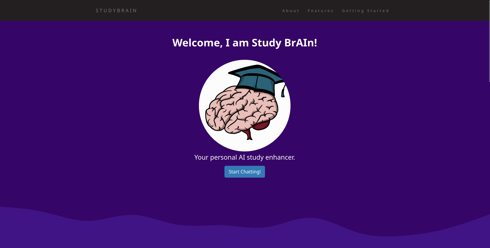
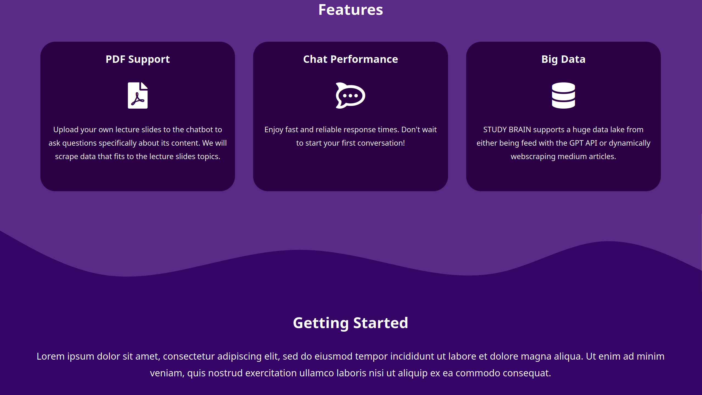
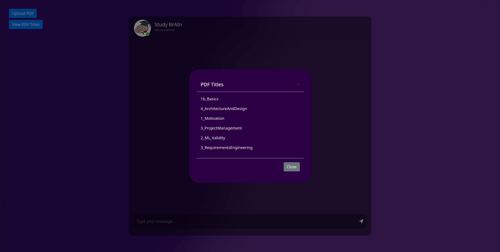

# StudyBrAIn

StudyBrAIn is a personal AI chatbot tutor designed to enhance your learning experience. It utilizes advanced language models to answer questions related to educational slides that you can conveniently upload as PDF files. The chatbot is integrated with a ChatGPT proxy, providing a seamless and interactive learning environment.

## Features

- **Slide-Based Q&A:** Upload your educational slides in PDF format, and StudyBrAIn will analyze and provide insightful answers to your questions based on the content.

- **AI-Powered Tutoring:** Leverage the power of language models to receive personalized and detailed explanations for concepts covered in your slides.

- **ChatGPT Integration:** StudyBrAIn is connected to a ChatGPT proxy, allowing for natural and dynamic interactions. You can engage in conversations, seek clarifications, and receive additional information beyond the slides.

